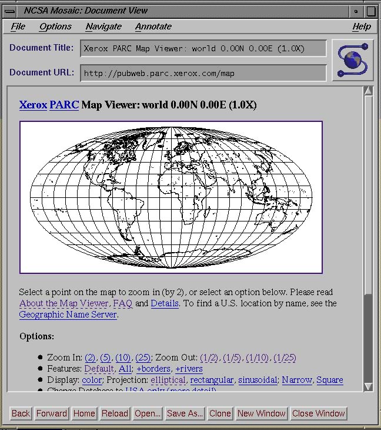

Slides are written to take you through the worksheets.

They should be self explanatory but are not the main course material. 

They are slides, worksheets are what will teach you real JavaScript.

 ([source](http://www.nic.funet.fi/index/FUNET/history/internet/en/1993.html))